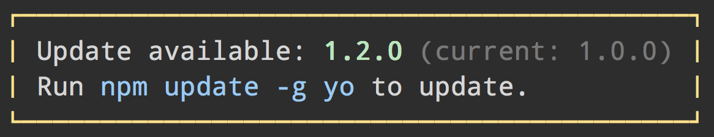

# update-notifier [](https://travis-ci.org/yeoman/update-notifier)

> Update notifications for your CLI app



Inform your package users of updates in a non-intrusive way.

Whenever you initiate the update notifier and it's not within the interval threshold, it will asynchronously check with NPM in the background for available updates, then persist the result. The next time the notifier is initiated the result will be loaded into the `.update` property. This prevents any impact on your package startup performance.
The check process is done with [fork](http://nodejs.org/api/child_process.html#child_process_child_fork). This means that if you call `process.exit`, the check will still be performed in its own process.

#### Table of Contents

* [Examples](#examples)
* [Docs](#documentation)
* [Settings](#settings)


## About

The idea for this module came from the desire to apply the browser update strategy to CLI tools, where everyone is always on the latest version. We first tried automatic updating, which we discovered wasn't popular. This is the second iteration of that idea, but limited to just update notifications.

There are a few projects using it:

- [Yeoman](http://yeoman.io) - modern workflows for modern webapps

- [Bower](http://bower.io) - a package manager for the web

- [Roots](http://roots.cx) - a toolkit for advanced front-end development

- [Automaton](https://github.com/IndigoUnited/automaton) - task automation tool

- [Spoon.js CLI](https://npmjs.org/package/spoonjs)

- [Node GH](http://nodegh.io) - GitHub command line tool

- [Hoodie CLI](http://hood.ie) - Hoodie command line tool

- [pullr](https://github.com/mojotech/pullr) - GitHub pull requests from the command line


## Examples

## Simple example

```js
var updateNotifier = require('update-notifier');
var pkg = require('./package.json');

updateNotifier({packageName: pkg.name, packageVersion: pkg.version}).notify();
```

### Comprehensive example

```js
var updateNotifier = require('update-notifier');
var pkg = require('./package.json');

// Checks for available update and returns an instance
var notifier = updateNotifier({
	packageName: pkg.name,
	packageVersion: pkg.version
});

// Notify using the built-in convenience method
notifier.notify();

// `notifier.update` contains some useful info about the update
console.log(notifier.update);
/*
{
	latest: '0.9.5',
	current: '0.9.3',
	type: 'patch', // possible values: latest, major, minor, patch, prerelease, build
	name: 'yeoman'
}
*/
```

### Example with settings and custom message

```js
var notifier = updateNotifier({
	packageName: pkg.name,
	packageVersion: pkg.version,
	updateCheckInterval: 1000 * 60 * 60 * 24 * 7 // 1 week
});

notifier.notify('Update available: ' + notifier.update.latest);
```


## API

### updateNotifier([settings])

Checks if there is an available update. Accepts settings defined below. Returns an object with update info if there is an available update, otherwise `undefined`.

### updateNotifier.notify([message || defer])

A convenience method that will inform the user about an available update (see screenshot). By default it will display the message right away. However, if you supply a custom message or `true` it will be displayed right before the process exits.

Only notifies if there is an update and the process is TTY.


### Settings


#### callback

Type: `function`  
Default: `null`

If provided, a callback function will be called,
passed `(error[, update])`

`update` is equal to `notifier.update`

#### packageName

*Required*  
Type: `string`

#### packageVersion

*Required*  
Type: `string`

#### updateCheckInterval

Type: `number`  
Default: `1000 * 60 * 60 * 24` (1 day)

How often it should check for updates.


### User settings

Users of your module have the ability to opt-out of the update notifier by changing the `optOut` property to `true` in `~/.config/configstore/update-notifier-[your-module-name].yml`. The path is available in `notifier.config.path`.

Users can also opt-out by [setting the environment variable](https://github.com/sindresorhus/guides/blob/master/set-environment-variables.md) `NO_UPDATE_NOTIFIER` with any value.

You could also let the user opt-out on a per run basis:

```js
if (process.argv.indexOf('--no-update-notifier') === -1) {
	// run updateNotifier()
}
```


## License

[BSD license](http://opensource.org/licenses/bsd-license.php) and copyright Google
